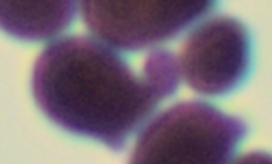

# Counting bacteria
Goal: count how many bacteria are on an images
Dataset: 10 images of multiple bacteria

## Notes
The goal is to count the number of bacteria present on the images. However, it is not always easy to define whether an element is a new bacterium or an growth that will become one later. 
A choice will therefore have to be made. Example:

The images have no noise and only contain bacteria. The images are blurry but that shouldn't be a problem. So there shouldn't be a lot of pre-processing needed.

### Plan
1. Transform the image into gray level and binarize it to have the bacteria in black.
   
2. Use erosion to separate bacteria that touch each other.

3. Segmentation: detects each bacterium with
   - Blob (Binary large object) detection?
   - Hough Transform to find circles in an image?
   - Edge detection?