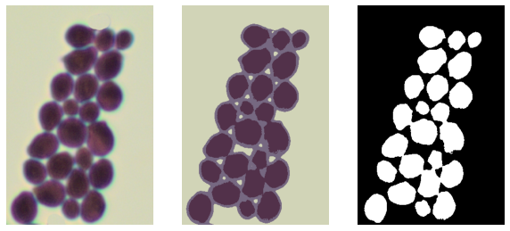
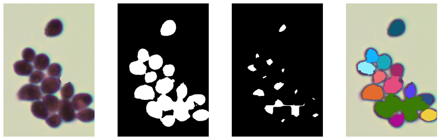
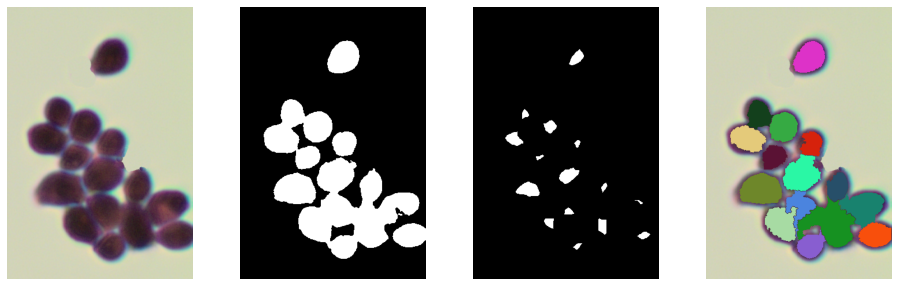
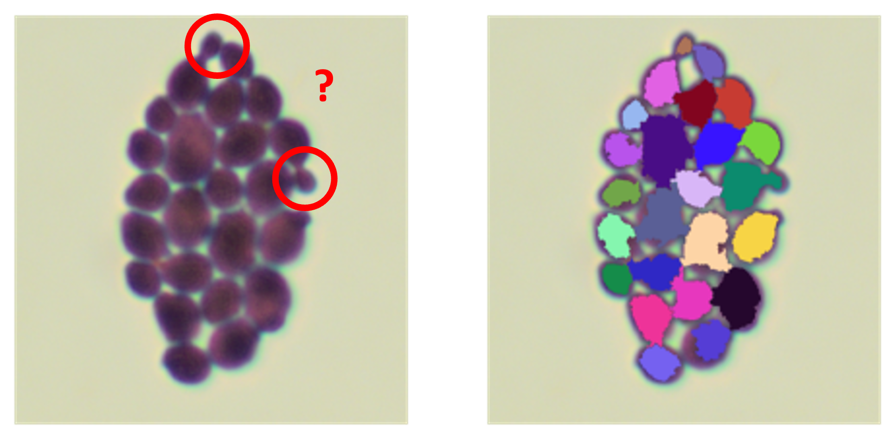
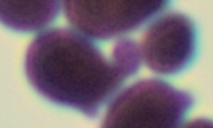

# Counting bacteria
- Count how many bacteria are on an image.
- Dataset: 10 images of multiple bacteria

## Current solution
### 1 - KMeans
First, use KMeans with k=3 which separates the image into 3 groups:
- Background
- Bacteria
- Borders of bacteria
  
Keep only the group of bacteria and binarize the image with Otsu. In this way, we obtain a first separation between the bacteria.

<p align="center">

</p>

### 2 - Multiple erosions
Use erosion to separate the bacteria that touch each other. The problem is that we need to apply the erosion enough times to separate all the bacteria, but if it is used too much, the small bacteria are deleted. So, it's necessary to find the right balance, but there is no value that is perfect for all images.
To solve this, use erosion several times and apply a correction if a bacterium is removed.

<p align="center">

</p>

We can use multiple erosion with this principle but up to a certain limit. That is, before a bacterium splits into two.

### 3 - Distance transform
This technique works for the majority of images but unfortunately it is not enough when bacteria really stick together.

<p align="center">

</p>

To solve this, first compare the size of the different groups of white pixels. If a group is much larger than the others, designate it as a potential group of several bacteria.

Then, for each “suspect” group, apply a transformation to separate potential bacteria. This time it use the cv::distanceTransform function and apply a certain threshold.

<p align="center">

</p>

Watershed is used to get a better representation of the bacteria that are detected with this patchwork of color.

### 4 - Evaluation
Some elements are unbiquous. It is diffucult to know if it's a bacterium or an growth that could become one later. 

<p align="center">

</p>

Thus, to test this solution, the bacteria have been counted in each image using range.

```
   "0004"      : [23]
   "0008"      : [47, 48]
   "0011"      : [23, 24, 25]
   "0013"      : [16]
   "0015"      : [13]
   "0016"      : [15]
   "0017"      : [15, 16, 17]
   "0018"      : [18, 19]
   "0018 copy" : [10]
   "0020"      : [25]
```

After that, the full process has been ran on all the images. The result is then compare with the ground truth to adjust the different hyperparameters like the erosion numbers or the threshold used in the distance transformation.

```
Candida.albicans_0004 : Number [23] - Found 23
Candida.albicans_0008 : Number [47, 48] - Found 48
Candida.albicans_0011 : Number [23, 24, 25] - Found 24
Candida.albicans_0013 : Number [16] - Found 16
Candida.albicans_0015 : Number [13] - Found 13
Candida.albicans_0016 : Number [15] - Found 15
Candida.albicans_0017 : Number [15, 16, 17] - Found 17
Candida.albicans_0018 : Number [18, 19] - Found 19
Candida.albicans_0018 copy : Number [10] - Found 10
Candida.albicans_0020 : Number [25] - Found 25
Accuracy: 100.0%
```

## First Idea
### Observation
The goal is to count the number of bacteria present on the images. However, it is not always easy to define whether an element is a new bacterium or an growth that will become one later. 
A choice will therefore have to be made. 

<p align="center">


</p>

The images doesn't have noise and only contain bacteria. The images are a bit blurry but that shouldn't be a problem. So there shouldn't be a lot of pre-processing needed.

### Plan
1. Transform the image into gray level and binarize it to have the bacteria in white.
   
2. Use erosion to separate bacteria that touch each other.

3. Segmentation: detects each bacterium with
   - Blob (Binary large object) detection?
   - Hough Transform to find circles in an image?
   - Edge detection?